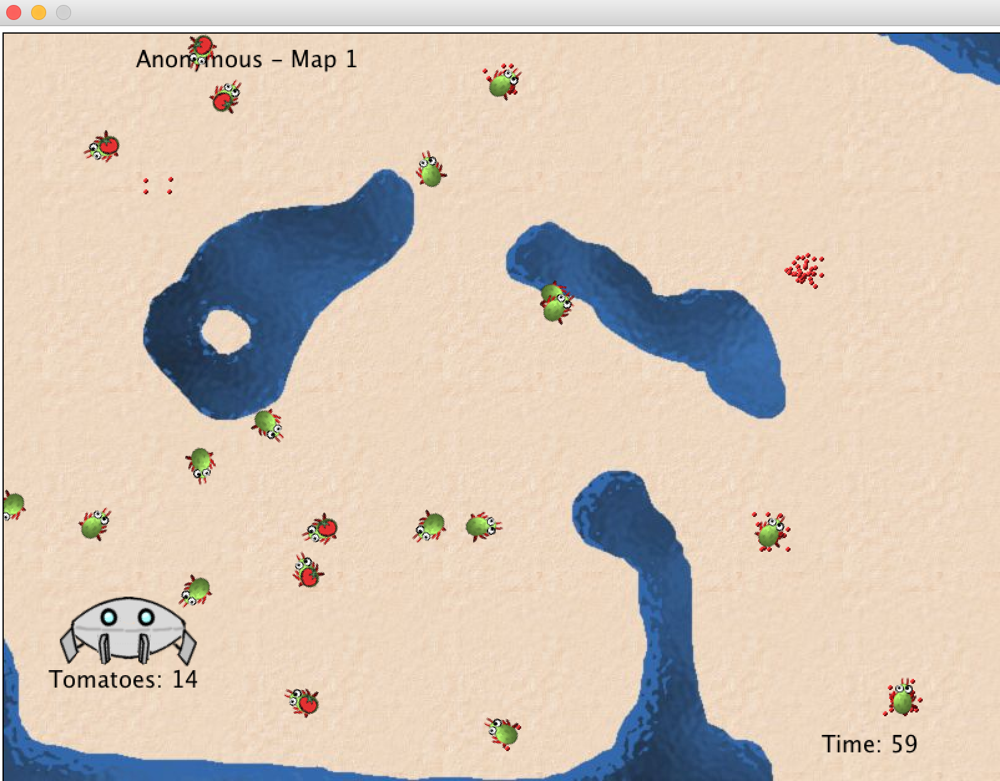

# G R E E P S   I N V A S I O N

* **Purpose**
    * To establish familiarity with conditional statements
* **Objective**
    * Modify the `Greep` class to collect `Tomato` objects and return them to the `Spaceship` while avoiding `Water` and obstacles.
* **Description**
    * Your task is to program the Greeps to collect as many `Tomato` as possible.
    * You may **ONLY CHANGE THE GREEP** class.
    * You may **not** change any other class.
* **Development Constraints**  
    1. Only change the class `Greep`. No other classes may be modified or 
created.
    2. No additional fields. You cannot extend the Greeps' memory.
        * you are not allowed to add fields to the class (except final fields).
        * You can use the one byte memory that is provided.
    3. You cannot `move` more than once per `act` round.
    4. You cannot communicate directly with other Greeps.
        * That is: no field accesses or method calls to other `Greep` objects are allowed.
        * Greeps can communicate indirectly via the `Paint` on the ground.
    5. No long vision.
        * You are allowed to look at the world only at the immediate location of the Greep.
        * Greeps are almost blind, and cannot look any further.
    6. No instantiating `Actor` subclasses.
        * `Actor` subclasses, such as `Greep` or `Paint`, cannot be instantiated. Greeps have no magic powers - they cannot create things out of nothing.
    7. No teleporting.
        * Methods from `Actor` that cheat normal movement (such as `setLocation`) may not be used.
        
        
### Background
* This application is built using the [Jfoot](https://github.com/Git-Leon/jfoot-api) library.